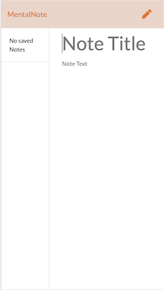

  # Mental Note
  
  
  ## Description 
  MentalNote is an application that helps you declutter your thoughts. It is a clean application that will let you create and save notes, view your old ones, and let you delete any you no longer need. MentalNote is a full-stack application featuring HTML5, CSS, Javascript/ES6, Node and Express.

     

  ## Table of Contents
  * [Installation](#installation)
  * [Usage](#usage)
  * [License](#license)
  * [Contributing](#contributing)
  * [Test Instructions](#test-instructions)
  * [Questions](#questions)

  ## Installation
    
    1. Download the MentalNote repository locally to your computer.   
    2. Run npm install in your bash/command line.

  ## Usage
      
    1. To run application, invoke with node server.js or nodemon server.js (recommended) in your bash/command line. 
    2. View the live application in your browser at localhost:8080

  ## License
  MIT (c) Hoang Nguyen   
  See LICENSE.md for details.

  ## Contributing
  Please check the app's GitHub issue tracker for known issues. Report bugs and requests to GitHub Issues.

  ## Test Instructions
  Install and run the application per instructions above. If using nodemon your terminal should display 'starting' and 'restarting' messages when changes are made on the application. Front-end changes (e.g. adding or deleting notes) will display 'Successfully updated database' message in your terminal.

  ## Questions
  For questions, reach out to me here:  
  Github: https://github.com/hngdngng  
  Email: [hoang.d.nguyen@outlook.com](mailto:hoang.d.nguyen@outlook.com)
  